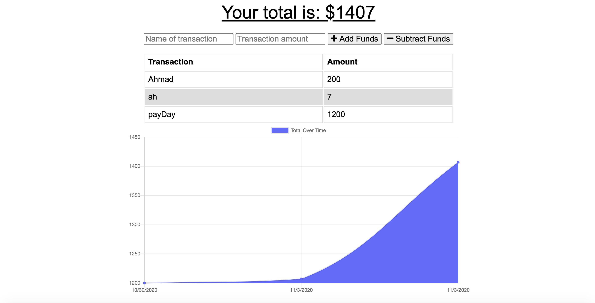

# Spending-Traker


## Description

It is a Progressive Budget app helpes traking you spending and using Mongo as Databeas and its able to function offline

## Table of Contents

- [Installation](#installation)

- [Usage](#usage)

- [License](#license)

  - [Contributing](#contributing)

  - [Tests](#tests)

  - [Questions](#questions)

  ## Installation

  To install necessary dependencies, run the following command:

  ```
  npm install
  ```

  ## Usage

  easy to use

  ## License

This project is licensed under the MIT license.

## img



## Tests

To run tests, run the following command:

```
npm tests
```

## Questions

If you have any questions about the repo, open an issue or contact me directly at karzoun_27@hotmail.com. You can find more of my work at [karzoun](https://github.com/karzoun/).
